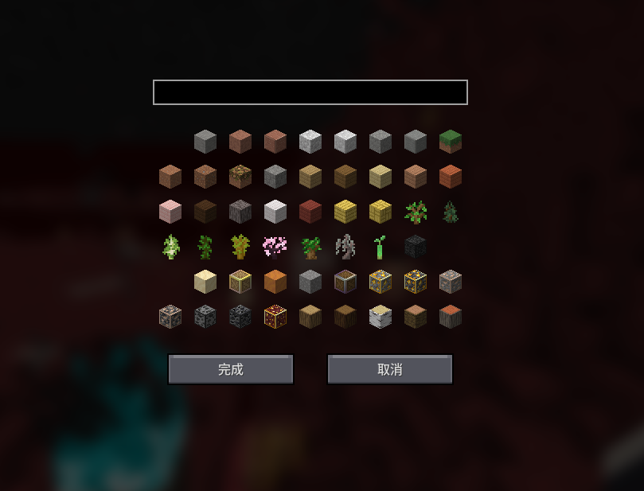
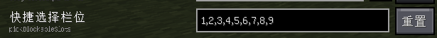

# Litematica Printer - K1nse_
==================

该模组为 投影(Litematica) 的 Minecraft Fabric 1.18.2 至 26.2 版本添加了自动建造功能。允许玩家通过自动放置周围正确方块来快速还原投影。

这是独立于三改版之外的四改版,主要特色为独立破基岩逻辑和更多小功能在其中~

本分支在社区版本基础上由 K1nse_ 做了以下调整：
- AxShulkers 服务器潜影盒取物适配
- 破基岩独立逻辑
- 打印优化
- 全新 UI，更加简洁

如果你觉得好用，可以给该项目点个 Star ⭐️ 来以支持我。

### 支持的游戏版本

目前该模组支持以下游戏版本：
- 1.21.9~11
- 26.1+
- 26.2

暂不支持 1.21.9 以下版本，一般版本进度会跟进上游分支

## 前置模组

该模组必须先安装 **Fabric API** , **MaLiLib** 和 **Litematica** 作为前置。可选前置有 **Twrakeroo** 和 **Quick Shulker**。

## 特性

- **🚀优化**
  - [x] 更流畅的打印体验
  - [x] 使用数据包打印功能（速度更快，无幽灵方块）
  - [x] 可视化放置进度条（显示打印HUD）
  - [x] 服务器卡顿检测，防止因卡顿导致的大量方块放置错误

- **⏩改进**
  - [x] AxShulkers 服务器潜影盒取物适配
  - [x] 打印优化
  - [x] 全新 UI，更加简洁
  - [x] 黑白名单更简单的添加
  - [x] 不会因缺少水源而在迭代水时卡死不打印的 bug
  - [x] 填充功能（使用投影的选区范围）
  - [x] 排流体功能（自动处理水源和岩浆源）
  - [x] 挖掘功能（按选区自动挖掘方块）
  - [x] 破基岩模式（在选区内自动执行基岩破除,可输入白名单）
  - [x] 放宽Tweakeroo凭空放置 (可在生存模式使用Tweakeroo的浮空放置~)
  - [x] 支持快捷潜影盒功能（AxShulkers）
  - [x] 支持Take It Out 远程取物功能
  - [x] 替换珊瑚（使用活珊瑚打印投影内的死珊瑚）
  - [x] 更好的破坏错误方块和破冰放水
  - [x] 支持多达 48 种范围迭代逻辑
  - [x] 支持破坏错误额外方块和错误状态方块
  - [x] 生命恢复2信标
  - [x] 独立的破基岩功能(可增白名单)
  - [x] 扫描器性能改进
  - [x] 含水方块放置逻辑
  - [x] 挖掘/填充/排流体改进迭代
  
- **🛠️修复**
  - [x] 修复很多方块的放置算法，包括：
    - 合成器、拉杆、红石粉（非连接模式）
    - 枯叶、各种花簇的方向数量
    - 发光浆果、带花的花盆
    - 楼梯、藤蔓、缠怨藤、垂泪藤
    - 砂轮、门、活版门、漏斗、箱子

## 黑白名单（更简单的 UI 添加）

打印/挖掘时可以通过**黑白名单**精确控制"哪些方块可以被自动破坏/挖掘"。在配置界面（`Z` 键打开）对应模式的分组中找到**白名单/黑名单列表**，将开关设为「自定义」后即可编辑。

### 两种使用场景

- **黑名单（推荐用于打印）**：把"不该被碰"的方块加进去——例如不想被自动破坏的红石元件、箱子、潜影盒、命令方块等。打印过程中会自动跳过并保护这些方块。
- **白名单（推荐用于挖掘）**：只允许破坏列表内的方块——例如批量清空选区内某种方块，其他方块一律不挖，防止误挖。

### 添加方块的 4 种格式

| 格式 | 示例 | 说明 |
|------|------|------|
| 物品 ID | `minecraft:stone` | 精确匹配单个方块 |
| 中文名称 | `砂岩` | 使用当前游戏语言的翻译名，无需记 ID |
| 标签 | `#minecraft:logs` | `#` 前缀，匹配整个标签组（一次加入多种方块） |
| 方块状态 | `minecraft:wheat[age=7]` | 精确到状态的方块，如指定成熟的小麦 |

### 组合筛选

输入 `带釉陶瓦,c`（文本 + 英文逗号 + `c`）表示**包含匹配**，会自动尝试拼音或直接匹配，适合一次过滤多种变体（如各种颜色的带釉陶瓦）。

> 💡 **选择建议**：不确定方块 ID 时直接用**中文名**或**标签**最方便；一次想排除整类方块（木头、石头等）用 `#` 标签；只针对特定状态（成熟作物、含水方块）用方块状态格式。

使用方法
----------

1. 在世界中加载一个原理图。
2. 身移到可以接触到原理图方块的地方。
3. 按下`Caps Lock`键开启打印机。
4. 享受自动的打印:)

> [!TIP]
> 
> 目前还没有官方的使用教程，但是大部分功能都含有注释可供参考使用。

## 未支持方块列表
以下方块由于特殊原因暂未实现，打印机将自动跳过，亦或者是呈现错误的打印状态。如果发现其他方块放置错误，请尝试降低建造速度。若问题依旧存在，请提交 [Issue](https://github.com/K1nse-91/litematica-Printer/issues)。
- 头颅，告示牌，旗帜(以及具有16个朝向的任何方块)
- 装有液体的炼药锅
- 实体方块（包括但不限于物品展示框、盔甲架、画等等）
- 非原版游戏内容

编译
----------
1. 使用任意方式将源码下载至你的机器上。
2. 运行`gradlew build`进行编译。
3. 构建出来的多版本jar文件位于 `./fabricWrapper/build/libs/`内，单独版本位于`./fabricWrapper/build/tmp/submods/META-INF/jars`内。

如果你想使用IDEA进行编译，请使用以下步骤：
1. 在IDEA中打开项目。
2. 在Gradle面板中，找到`Tasks -> build`，双击`build`任务进行编译。
3. 编译完成后，构建出来的多版本jar文件位于 `./fabricWrapper/build/libs/`内，单独版本位于`./fabricWrapper/build/tmp/submods/META-INF/jars`内。

> [!TIP]
> 
> 在中国大陆环境可能会导致支持库下载失败。请尝试使用**代理**进行下载。

常见问题
----------

### 为什么开启打印后，打印机不工作？
- 由于投影打印机是基于发送静默看向的方式进行打印的，不会考虑点击面合法化，所以会被服务器反作弊检测。
- `打印机工作间隔`设置过小，导致类似于 Luminol 等有放置速率限制的服务器不会及时响应，请尝试开启`使用数据包打印`功能打印或者调高`打印机工作间隔`。 
- 某些玄学问题，在开启正版验证的服务器里打印数据交互不正常。可尝试重新登陆游戏账号。（推荐使用[AuthMe](https://modrinth.com/mod/auth-me)模组） 

如果以上方法都无法解决问题，请尝试提交 [Issue](https://github.com/K1nse-91/litematica-Printer/issues) ，开发者会协助您解决问题。

### 为什么打印机放置的方块是错的？

1. 服务器装有反作弊插件，可能会导致打印机无法模拟看向放置。
2. 打印机工作间隔设置过小，服务器无法及时响应，导致方块出现错误。属于正常现象，请尝试增大`打印机工作间隔`的值。
3. 识别算法没有考虑到关于的方块，导致打印机不会正确处理。请提交 [Issue](https://github.com/K1nse-91/litematica-Printer/issues/new?template=%E6%89%93%E5%8D%B0%E6%96%B9%E5%9D%97%E8%AF%B7%E6%B1%82.yml) ，表明什么方块出现错误。

### 快捷潜影盒功能无法使用？

1. 服务器未装有可以在背包右键打开潜影盒的插件(推荐使用AxShulkers)，无法使用快捷潜影盒功能。
2. 投影打印机设置与实际能用的模式不符，请调整为正确支持的模式。
3. 预选栏位填满了潜影盒。须在Litematica设置中设置好`pickBlockableSlots`（快捷选择栏位）值。如图所示：

快捷潜影盒仍处于测试阶段，可能会有一些问题，如果遇到问题请提交[Issue](https://github.com/K1nse-91/litematica-Printer/issues)。

感谢
----------
- [K1nse_/litematica-printer](https://github.com/K1nse_/litematica-printer): 感谢 [K1nse_](https://github.com/K1nse_) 对本分支的优化与适配。
- [MoRanpcy/quickshulker](https://github.com/MoRanpcy/quickshulker): 新版的快捷潜影盒支持。
- 以及所有支持开发的人，包括你！
